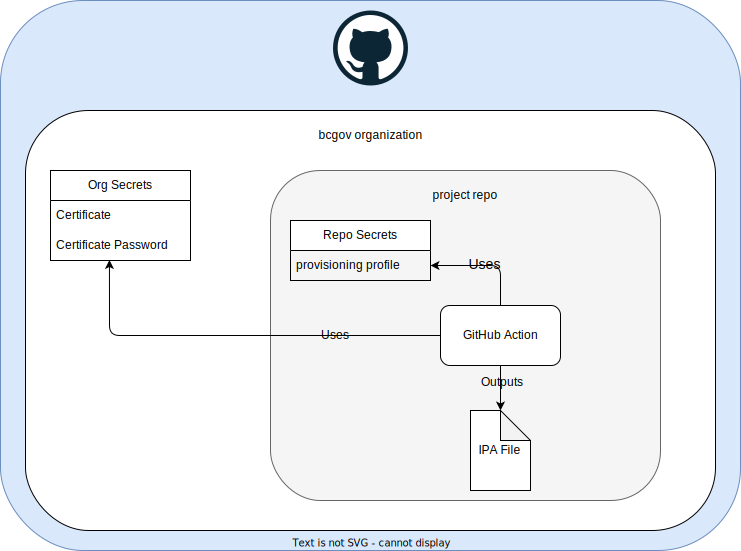

# Apple Signing

To learn about code signing, please review Apple's [code signing](https://help.apple.com/xcode/mac/current/#/devfbe995ebf) documentation. 

This guide details how to work with signing certificates.

# Certificates
Apple provides two types of certificates:

* Development
* Distribution

Both certificate types need the app's [bundle id](https://developer.apple.com/documentation/appstoreconnectapi/bundle_ids). It was created during the project's onboarding phase. Please see your Product or Technical Owner if you do not have the bundle id. 

 
## Development

Developer accounts are set to have access to development certificates, identifiers & profiles.  You can access them within Xcode by setting the team to the Province of BC. Please review Apple's [Assign a project to a team](https://help.apple.com/xcode/mac/current/#/dev23aab79b4) documentation for details on how to do this. Please use the "automatically manage signing" option. 

Developers may install the app on their own device. This can be [setup through Xcode](https://developer.apple.com/documentation/xcode/distributing-your-app-to-registered-devices#Register-devices-automatically-in-Xcode). Please use [TestFlight](https://testflight.apple.com) if you need to test on many devices.

## Distribution

You must use the Province of BC's signing certificate to distribute the app. This certificate is used when exporting the app to the AppStore and TestFlight. It also allows the app to use the [AdHoc distribution method](https://developer.apple.com/documentation/xcode/distributing-your-app-to-registered-devices). 

If your app's code is in the [bcgov GitHub organization](https://github.com/bcgov), then please use a [GitHub Action](https://docs.github.com/en/actions) to build and sign your app. Refer to GitHub's [Installing an Apple certificate on macOS runners for Xcode development](https://docs.github.com/en/actions/deployment/deploying-xcode-applications/installing-an-apple-certificate-on-macos-runners-for-xcode-development) documentation for details. Please send your GitHub repo's name to the Developer Experience Team. We will give it access to the certificate and password secrets. Your repo will contain the provisioning profile secret. 

See the [bc-wallet-mobile](https://github.com/bcgov/bc-wallet-mobile/blob/main/.github/workflows/main.yaml) project for an example of a project using GitHub Actions.

Please contact the Developer Experience team if you are not using GitHub. We will discuss other options for using the distribution certificate.

# Provisioning Profiles

Provisioning profiles links the bundle id with a certificate and optional associated devices. As with certificates, there are also development and distribution provisioning profiles.

