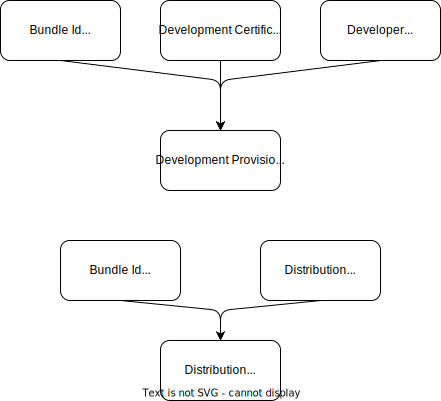

# Apple signing

This guide details how to work with signing certificates.

To learn about code signing, review Apple's [code signing](https://help.apple.com/xcode/mac/current/#/devfbe995ebf) documentation. 


## Certificates
Apple provides 2 types of certificates:

* Development
* Distribution


Both certificate types need the app's [bundle id](https://developer.apple.com/documentation/appstoreconnectapi/bundle_ids). Remember, this was created during the project's onboarding phase. Talk to your Product or Technical Owner if you don't have the bundle id. 

 
### Development

Developer accounts are set up to have access to development certificates, identifiers and profiles. You can access them within Xcode by setting the team to the Province of BC. 

Review Apple's [Assign a project to a team](https://help.apple.com/xcode/mac/current/#/dev23aab79b4) documentation for details on how to do this. Turn on the "automatically manage signing" in the Signing and Capabilities -> Debug tab.

Developers may install the app on their own device. This can be [setup through Xcode](https://developer.apple.com/documentation/xcode/distributing-your-app-to-registered-devices#Register-devices-automatically-in-Xcode). Use [TestFlight](https://testflight.apple.com) if you need to test on many devices.


### Distribution

You must use the Province of BC's signing certificate to distribute the app. This certificate is used when exporting the app to the AppStore and TestFlight. It also allows the app to use the [AdHoc distribution method](https://developer.apple.com/documentation/xcode/distributing-your-app-to-registered-devices). 

#### CI/CD build
If your app's code is in the [bcgov GitHub organization](https://github.com/bcgov), then use a [GitHub Action](https://docs.github.com/en/actions) to build and sign your app. Refer to GitHub's [Installing an Apple certificate on macOS runners for Xcode development](https://docs.github.com/en/actions/deployment/deploying-xcode-applications/installing-an-apple-certificate-on-macos-runners-for-xcode-development) documentation for details. 

Send your GitHub repo's name to the [Developer Experience Team](contact.md). We will give it access to the certificate and password secrets. Your repo will contain the provisioning profile secret. 


Setup the project to work with manual certificates. In the Signing & Capabilities -> Release tab in Xcode:

* Turn off "automatically manage signing" 
* Download/Import the provisioning profile for your app

Contact the [Developer Experience team](contact.md) if you're not using GitHub. We'll discuss other options for using the distribution certificate.

#### Laptop build
Are you releasing your app from a developer's laptop? Let the [Developer Experience team](contact.md) know so we can give you access to the distribution certificate. Then turn on "automatically manage signing" in the Signing & Capabilities -> Release tab in Xcode. 

We encourage you to use a CI/CD pipeline to build and release your app. It allows for repeatable builds and removes reliance on a developer's computer.


## Provisioning profiles

Provisioning profiles links the bundle id with a certificate and optional associated devices. As with certificates, there are also development and distribution provisioning profiles.





## CI/CD

### exportOptions.plist

The `-exportArchive` flag on the `xcodebuild` command signs the app. This command also takes the `-exportOptionsPlist` flag. This `.plist` file contains configuration information for the build.

```xml
<?xml version="1.0" encoding="UTF-8"?>
<!DOCTYPE plist PUBLIC "-//Apple//DTD PLIST 1.0//EN" "http://www.apple.com/DTDs/PropertyList-1.0.dtd">
<plist version="1.0">
<dict>
	<key>teamID</key>
	<string>TEAM_ID_HERE</string>
	<key>method</key>
	<string>app-store</string>
	<key>signingStyle</key>
	<string>manual</string>
	<key>stripSwiftSymbols</key>
	<true/>
	<key>uploadBitcode</key>
	<false/>
	<key>uploadSymbols</key>
	<true/>
	<key>provisioningProfiles</key>
	<dict>
		<key>ca.bc.gov.YOUR_APP</key>
		<string>YOUR_APPS_UUID_STRING</string>
	</dict>
</dict>
</plist>
```

The `provisioningProfiles` string value is the provisioning profile's UUID. To get the UUID run the following command:

```shell
security cms -D -i your_provisiong_profile.mobileprovision
```

Look for the `UUID` key in the output. Its value is the provisioning profile's UUID. 

### Example

The [bc-wallet-mobile](https://github.com/bcgov/bc-wallet-mobile/blob/main/.github/workflows/main.yaml) project has a complete GitHub Action that builds an iOS app. Use it as a reference for your project.

This is a basic GitHub Action that builds and signs an app.

```yaml
name: Build
on: 
  push:
    branches: [ "main" ]
   
jobs:
  build-ios:
    name: Build and sign ios
    runs-on: macos-latest

    env:
      PROJECT: ${{ 'Your_App_Name.xcworkspace' }}
      SCHEME: ${{ 'Your_App_Name' }}
      DATA_DIR: ${{ 'xcbuild' }}
      ARCHIVE_NAME:  ${{ 'Your_App_Name.xcarchive' }}
      EXPORT_DIR: ${{ 'export' }}
      IPA_NAME: ${{ 'Your_App_Name.ipa' }}
    
    steps:
      - name: Checkout
        uses: actions/checkout@v3
      
      - name: Display XCode Path for debug
        run: |
          xcode-select -p  

      - name: Cache Pods
        uses: actions/cache@v3
        with:
          path: ios/Pods
          key: ${{ runner.os }}-pods-${{ hashFiles('**/Podfile.lock') }}
          restore-keys: |
            ${{ runner.os }}-pods-   
          
      - name: CocoaPod Install
        run: pod install 

      # from https://docs.github.com/en/enterprise-cloud@latest/actions/deployment/deploying-xcode-applications/installing-an-apple-certificate-on-macos-runners-for-xcode-development
      - name: Install the Apple certificate and provisioning profile
        env:
          # The first two keys are from the bcgov organization secrets
          BUILD_CERTIFICATE_BASE64: ${{ secrets.BUILD_CERTIFICATE_BASE64 }}
          P12_PASSWORD: ${{ secrets.IOS_BUILD_CERTIFICATE_PASSWD }}
          # These two keys are from your app's repo secrets
          BUILD_PROVISION_PROFILE_BASE64: ${{ secrets.IOS_PROVISION_PROFILE_BASE64 }}
          KEYCHAIN_PASSWORD: ${{ secrets.KEYCHAIN_PASSWORD }}
        run: |
          # create variables
          CERTIFICATE_PATH=$RUNNER_TEMP/build_certificate.p12
          PP_PATH=$RUNNER_TEMP/build_pp.mobileprovision
          KEYCHAIN_PATH=$RUNNER_TEMP/app-signing.keychain-db

          # import certificate and provisioning profile from secrets
          echo -n "$BUILD_CERTIFICATE_BASE64" | base64 --decode --output $CERTIFICATE_PATH
          echo -n "$BUILD_PROVISION_PROFILE_BASE64" | base64 --decode --output $PP_PATH

          # create temporary keychain
          security create-keychain -p "$KEYCHAIN_PASSWORD" $KEYCHAIN_PATH
          security set-keychain-settings -lut 21600 $KEYCHAIN_PATH
          security unlock-keychain -p "$KEYCHAIN_PASSWORD" $KEYCHAIN_PATH

          # import certificate to keychain
          security import $CERTIFICATE_PATH -P "$P12_PASSWORD" -A -t cert -f pkcs12 -k $KEYCHAIN_PATH
          security list-keychain -d user -s $KEYCHAIN_PATH

          # apply provisioning profile
          mkdir -p ~/Library/MobileDevice/Provisioning\ Profiles
          cp $PP_PATH ~/Library/MobileDevice/Provisioning\ Profiles    
    
      - name: Increment Build No.
        env:
          BUILD_NO: ${{ github.run_number }}
        run: |
          # Set Build Number. Not worrying about storing to repo.
          agvtool new-version -all ${BUILD_NO}

      - name: Build For Release
        run: |
          xcodebuild \
          -workspace $PROJECT \
          -scheme $SCHEME \
          -configuration Release \
          -sdk iphoneos \
          -derivedDataPath $DATA_DIR \
          -archivePath ${DATA_DIR}/${ARCHIVE_NAME} \
          archive

      - name: Export Archive 
        # This is the step that signs the build
        run: |
          xcodebuild \
          -exportArchive \
          -archivePath ${DATA_DIR}/${ARCHIVE_NAME} \
          -exportPath $EXPORT_DIR \
          -exportOptionsPlist exportOptions.plist \
          -verbose
      
      - name: Upload a Build Artifact
        uses: actions/upload-artifact@v3
        with:
          name: ios-release
          path: ${{ env.EXPORT_DIR }}
          if-no-files-found: error
          retention-days: 5
```
